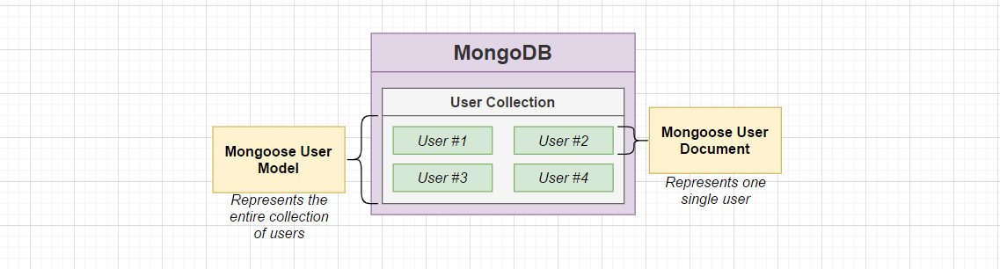

# Auth service
## Route handlers
The auth service has a root controller for handling Signup, Signin, Signout, current-user requests.
## Topics to learn:

* use `express.Router()` object to make a custom router for different API endpoint.
* use `export { router as routerA }` to rename the export object in order to differentiate individual routers when importing from other files.
* Custom Router object as an Express middleware:
  * use `app.use(routerA)` to use the custom RouterA from the previous step as an Express middleware.
* Data validation - use express-validator to check the data
  * `import {body} from 'express-validator` --- body method is used as a middleware before Express calls the callback function
  * `validationResult` is used in the request handler to catch any errors.
```javascript
  const errors = validationResult(req);
    if (!errors.isEmpty()) {
      // set the error status to 400, and send an array of errors back to client as JSON data
      return res.status(400).send(errors.array());
    }
```
  * With microservice setup which may use different language/frameworks, the error message generated from each microservice might have a very different structure --- it's a HUGE issue.
    
    * solution: each microservice should send a standard structure of the response to the front end app.
    
* Error handling
  * consistently structured response from all services is required -> Use Middleware to handle errors
  * Each of the error type should be handled consistently  -> Express's error handling mechanism (call the 'next' function) to capture all possible errors
  * Express custom error handlers have 4 function arguments: (err, req, res, next)
    
    > Epress will automatically count the number of arguments and it knows the handlers will handle the errors
  
* Async Error handling
  
  * use `express-async-errors` package with log errors from async/await request handlers
  * `import "express-async-errors";` statements goes after the express import
  
* One database per microservice: use Mongoose and MongoDB
  
  * DB is hosted and managed by a K8s Pod
  
* Middleware in Express

  * Middleware/callback function expression needs to use `function` keyword only instead of arrow function.
  * That’s because `this` in side the function will be pointing to the actual `user` object we are trying to save to the DB. If arrow function is used, `this` will be overwritten to the current context of the function, which is the `user.ts` file. ---> NOT OK!

* Handle User authentication with microservices

  * No one way is right to solve the authentication problem; we can only pick a best way out of all possible solutions

  * Use JWT tokens to authenticate Users: Pros:  App can run when Auth service is down; Cons: time delay is there when user’s access is revoked.

    * Different ways of using the JWT tokens

    1. Attach the JWT token in HTTP request `Authorization` header: `Authorization: MY JWT`
    2. Attach the JWT token in HTTP request body: `{token: MY JWT}`
    3. Attach the JWT token in `Cookies: MY JWT` from each request

  * Design:

    * User uses email and password to sign-in; once Auth service validates the credentials, a JWT Token is issued to the User and send back. JWT token or cookie is only good for 15 mins, and every subsequent request will include this token/cookie.
    * Other service, such as Orders service, will include logic to inspect the JWT/Cookie to check if the user is valid and authenticated. if JWT/Cookie is older than 30 mins, reach to Auth service to trigger the Token Refresh logic.
    * Problem: how should other services reject the user who just get access revoked?
      * Design a UserBanned Event and emit this event from Auth service to the event bus
      * All other services should listen to the UserBanned Event, and should implement a short-lived in memory cache to record banned users --- no persistent data is needed

  * Difference between Cookies and JWTs

    * Cookies are:
      * Transport mechanism --- authorization is not the primary goal
      * Moves any kind of data between browser and server
      * Automatically managed by the browser
    * JWT’s are
      * Authentication/Authorization mechanism
      * Stores any data we want
      * Have to manage it manually

  * Server side rendering introduce new challenges to User authorization in the very first request.

    * Service side rendering requires the User to authenticate themselves in the first request because the backend server will use the authentication information to prepare data from other services, such as Orders service and Ticketing service
    * By nature, when the user first types a URL and hit enter, browser cannot use JS to process the JWT token, or customize the request in any way, in the very first request. ***So only transmitting the JWT in the Cookies header is the only way to get around this issue.***

* **JWT token** is generated by `jsonwebtoken` package, and send back to user’s browser with the help of `cookie-session` library ---> it stores the session data in the cookie so that every subsequent request from the client will contain all the required information for other services to consume.

  * `express:sess : eyJqd3QiOiJleUpoYkdjaU9pSklVekkxTmlJc0luUjVjQ0k2SWtwWFZDSjkuZXlKcFpDSTZJall3TnpFeU1USTNOMkU0TldJeU1EQXlORFUwTWpZeVl5SXNJbVZ0WVdsc0lqb2lZV0pqWkVCbmJXRnBiQzVqYjIwaUxDSnBZWFFpT2pFMk1UZ3dNalkzT1RGOS5yaUZDYnE4UE9MTWQwRVhjU1d5c2hyelJ2RkpuNHlfc3QtS0FxWmFrV0U4In0= `

* Env Variables - constants can be plug into Pods as environment variable sets

  * Creating a secret - Make use of K8s command:

    * key value pair is specified using option `--from-literal=<key>=<value>`

    * `kubectl create secret generic jwt-secret --from-literal=jtw=MY_TOP_SECRET`

    * > Cons: when create or spin up a new cluster, need to remember all different secrets over time.

    * In prod environment, usually takes the config file approach

      ```yaml
      apiVersion: v1
      kind: Secret
      metadata:
        name: mysecret
      type: Opaque
      data:
        username: ABC
        password: MWYyZDFlMmU2N2Rm
      ```

  * Use the secret in code: `process.env.JWT_KEY` and make sure use type guard to avoid undefined errors. Use `kubectl describe secret <name of secret> ` to inspect the defined secret.

* Extract middlewares

  * Use Express middleware to handle the common request validation for emails and password, etc.
  * Remember, middleware will throw error early if the request has failed the validation.
    * The order of the middlewares in the Express Routes are preserved.
  * Use middleware to extract JWT payload and set it on `req.currentUser`
  * Use middleware to reject the request if the user is not logged in

## MongoDB

MongoDB organize information into different collections.



Mongoose User Model: represents the entire collection of users.

​	Use this class to run queries to do CRUD operations on users.

Fix issues with typescript’s type checking when creating a new User Document, and reading user Document with additional mongoose related properties such as `createdAt` and `updatedAt`

* Solution: teach TS about the properties and types by using interface
  * Create an interface that describes the props of User Model, and User Document
  * User a factory method from a Mongoose Schema to create new User Documents: `userSchema.statics.build = (attr) => new User(attr)`
    * When use it, call `User.build()` to return new User Document object

Data types in Schema:

* data types in TS interface/type is lowercase: such as `string`
* in Mongoose, the data type is uppercase: `String` -- *referring to an actual constructor*

`pre` method used with Mongoose Schema object.

> `pre('save', cb)` method will be called when user.save() is called every time

Format the JSON properties using Mongoose Schema options when we need to remove some sensitive information or return a custom object.

* Use `toJSON()` and `transform` option to modify the returned object from the query.

* Since JSON.stringify() method will look for the toJSON() method if supplied in the object to get a string representation of the object, we can use `transform` function to apply the formats before returning.

* ```javascript
  const userSchema = new mongoose.Schema(
    {
      email: {
        type: String,
        required: true,
      },
    },
    {
      toJSON: {
        transform(doc, ret) {
          delete ret.__v;
          ret.id = ret._id;
          delete ret._id;
        },
      },
    }
  );
  ```


Mongodb-momory-server --- npm package

It allows setting up Mongodb in memory for fast tests, and it’s able to run multiple instances.

## Password Hashing

Popular practice: place hashing logic directly into the User Model file.

Our approach:

1. Save the password hashing functions at a separate location `~/services/password.ts`
2. 

## TS knowledge:

* `private` and `public` keyword in constructor argument
```javascript
class TestClass {
  constructor(name: string, private address: string, public city) { }

  testMethod() {
    console.log(this.name) // Compiler error: Property 'name' does not exist on type 'TestClass'.
    console.log(this.address);
    console.log(this.city);
  }
}

const testClass = new TestClass('Jane Doe', '123 Main St.', 'Cityville');

testClass.testMethod();

console.log(testClass.name);    // Compiler error: Property 'name' does not exist on type 'TestClass'.
console.log(testClass.address); // Compiler error: 'address' is private and only accessible within class 'TestClass'.
console.log(testClass.city);
```
* `interface` and abstract classes to ensure code reusability
  * TS interface describes the structure of an object or a group of values, and enforce the "contract" to implement correctly
    * loose coupling
    * set up a contract between different classes
    * Best when we have very different objects that we want to work together
  * TS abstract classes 
    * Strong coupling
    * Best when we are trying to build up the definition of an object -- set up requirements for subclasses
    * It CANNOT be instantiated
  * Difference: TS interface does not exist at runtime, TS abstract class exists at runtime, yet it's an incomplete implementation
    * Can use `instanceof` checks: TS abstract class will create a class object when translated to JS
  * Summary: Always reach out for interfaces first, and use abstract classes when we want to "inject" functionality to a similar class
  
* Generics in TS
  
  * Think of these `<T, U>` as being some arguments to the function of model
  
* Tell TS to manually specify the type of the variable: `const buff = (await scryptAsync(*password*, salt, 64)) as Buffer`. Now the `buff` will be recognized as `Buffer` type
  
  * Also, use `!` after a variable name to tell TS that the variable is already defined. e.g. `process.env.JWT_KEY!`
  
* `toJSON()`
  
  * In JavaScript, the [`JSON.stringify()` function looks for functions named `toJSON` in the object being serialized. If an object has a `toJSON` function, `JSON.stringify()` calls `toJSON()` and serializes the return value from `toJSON()` instead.
  
* When introducing new property on object with existing types, augment the definition of the existing type by a `declare` block.

  * ```typescript
    /**
     * Augment/update the existing Request type by using a declare block.
     */
    declare global{
      namespace Express{
        interface Request {
          currentUser?: UserPayload;
        }
      }
    }
    ```

## Testing with Microservices

Define the testing scope: --> from small scale to bigger scale

1. Test a single piece of code in isolation (Unit test)

   Single middleware

2. Test how different pieces of code work together  

   Request flowing through multiple middlewares to a request handler

3. Test how different components work together

   Make request to service, ensure write to DB was completed

4. Test how different services work together

   Creating a ‘payment’ at the ‘payments’ service should affect the ‘orders‘ service

One option is to run the test directly from the terminal. --> `npm start test`

* Use Jest to run the test scripts

***Define Environment variable*** in the test environment, especially running it locally in terminal with Jest

* Directly set it in the `beforeAll()` function if using Jest

Need to differentiate the secure HTTP access rules in test environment -> Supertest is not sending HTTP request in a secure channel, which means it’s not sending over HTTPS. We need to figure out how to make a secure request in test env or change the secure request option in the code to false.

* Set the cookieSession option in test environment to `{secure: false}`  is the most time-effective way.
* in `app` component, change the `{secure: process.env.NODE_ENV_VAR}` in cookie session.

### Jest

The following approach will be used to test the microservice

* start in-memory copy of MongoDB
* start up the Express app
* use ***supertest*** library to make fake requests to the express app
* run **assertions** to make sure the request did the right thing

Setup functions in Jest

* *hook function: `beforeAll()` will be executed before all test suites start*
* *`beforeEach()` will be executed before each test starts*
* *clean up function, `afterAll()`, will be executed after the tests finish.*
* Naming conventions: in each folder, create a `__test__`  folder to store test files with the name `<test-name>.test.ts`
* Setup config should be saved in `/src/test/setup.ts` file

### Supertest

Supertest provides a high-level abstraction for testing HTTP. It can be used with any test framework like Jest, and mocha

```javascript
import request from "supertest";
import { app } from "../../app";

it("fails when a email that does not exist is supplied", async () => {
  await request(app)
    .post("/api/users/signin")
    .send({
      email: "test@test.com",
      password: "password",
    })
    .expect(400);
});
```

> NOTE: supertest by default is not configured to manage cookies automatically

Cookie with Supertest

* Extract the cookie from the previous request and save it to a variable
* Then use `.set()` method to set `{Cookie: myCookie}` to the next request before calling the `.send()` method


## NextJS

Basic components:

* Pages are special NextJS  React components  in the `pages` directory. Each page is associated with a route based on its file name. ---> `/about` is tied to `/pages/about.js`; `/` is associated with `/pages/index.js`

  * ```javascript
    //Example: If you create pages/about.js that exports a React component like below, it will be accessible at /about.
    
    function About() {
      return <div>About</div>
    }
    
    export default About
    ```

* 

